# Lua-scripts

The goal for this repo is to have a central place to share example Lua scripts, host any 'new' scripts, and to document where to find Lua scripts that already exist, as well as any tips or tricks related to getting started with them.

Games and other fun Lua scripts are listed [seperately here](/games.md).

---

## ExpressLRS

### [ExpressLRS Lua](https://www.expresslrs.org/quick-start/transmitters/lua-howto/)

LUA configurator for ExpressLRS hardware 
<a href="https://www.expresslrs.org/quick-start/transmitters/lua-howto/">
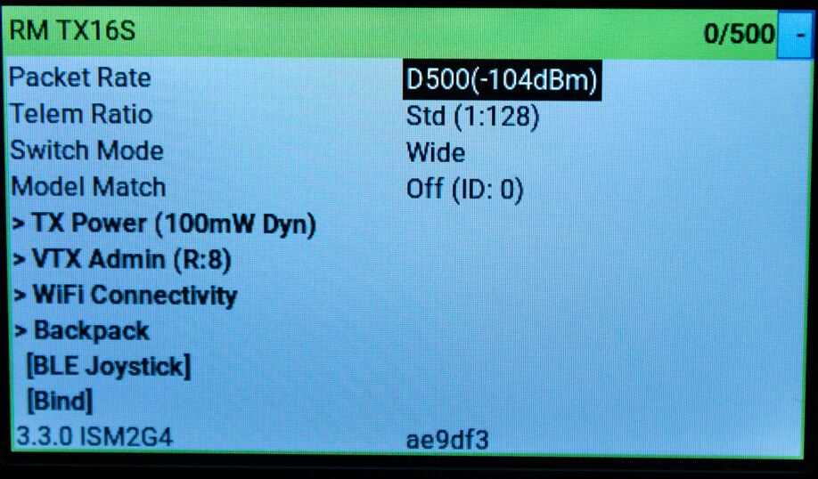
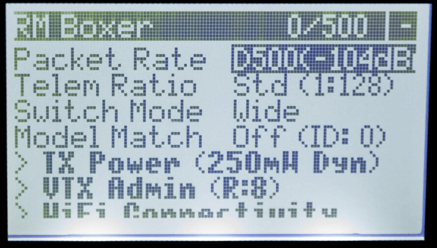
</a>

 

### [ExpressLRS Telemetry Widget (Betaflight & iNav)](https://github.com/ExpressLRS/ElrsTelemWidget)

Display ExpressLRS LinkStats telemetry as well as common Betaflight and iNav flight controller telemetry. 
<a href="https://github.com/ExpressLRS/ElrsTelemWidget">
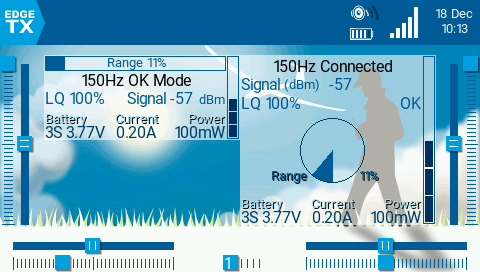
</a>

 

### [ExpressLRS RF Telemetry Widget (for fixed wing/heli)](https://github.com/offer-shmuely/edgetx-x10-widgets/wiki/els_rf)

- Display **_RF Only_** telemetry for Planes/Heli/Glider (i.e. line of site)
- Display rf-rate / link-quality / power / rssi1 / rssi2
- Display **min & max** indicator
- **Post flight summary** (auto-detection end-of-flight)

<a href="https://github.com/offer-shmuely/edgetx-x10-widgets/wiki/els_rf">
    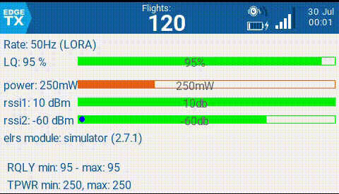
</a>

 

### [ELRS Finder](https://github.com/iamsunilchahal/edgetx-lua-scripts-bw?tab=readme-ov-file#1-elrs_finderlua)

An RSSI-based quad finder using ELRS/CRSF telemetry.

- Shows live signal strength (dBm)
- Displays a bar graph and numeric value
- Plays faster beeps as you point toward the quad

### [ExpressLRS Signal/Battery Widgets for ColorLCD](https://github.com/SpiderFI)
- LQorDBM for LQ, DBM, SNR and TX power
- TXBatt for transmitter battery voltage and percentage
- Battery for any battery sensor

<a href="https://github.com/SpiderFI">
    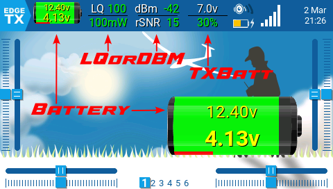
</a>

 

## GPS

### [Yaapu telemetry widget](https://github.com/yaapu/FrskyTelemetryScript)

ArduPilot LUA telemetry script for color and B&W. 
<a href="https://user-images.githubusercontent.com/30294218/198382377-cb48032f-ea5c-4f8d-aa12-f592c1e09358.png" target="_blank" title="Click for larger version">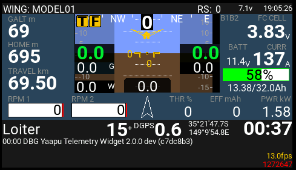</a>
<a href="https://user-images.githubusercontent.com/30294218/216000387-f330a204-b674-48ea-bdaf-64ec33871eb2.png" target="_blank" title="Click for larger version">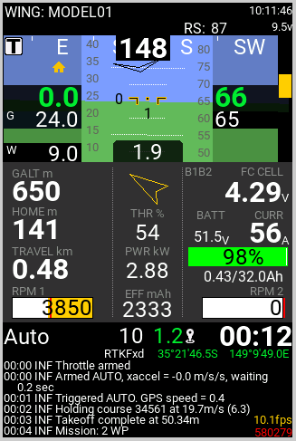</a>
<a href="https://user-images.githubusercontent.com/30294218/215983189-06106fe8-b0d8-47f5-8e3f-e8d2472028ee.png" target="_blank" title="Click for larger version">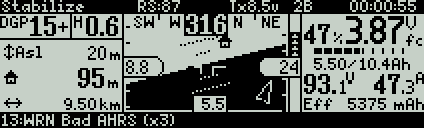</a>
<a href="https://user-images.githubusercontent.com/30294218/215983214-b11f53a6-90f4-40ba-a29d-90a58cf6f1ff.png" target="_blank" title="Click for larger version">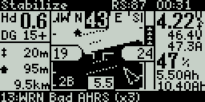</a>

 

### [Yaapu Horus Mapping Widget](https://github.com/yaapu/HorusMappingWidget)

Offline GPS Mapping Widget for Horus and T16 radios. It supports Ardupilot, iNAV, Betaflight, Crossfire and whatever FC or firmware that can send GPS info to EdgeTX. 
<a href="https://user-images.githubusercontent.com/30294218/76712734-946a6500-671b-11ea-9fbc-6c779cf4d0b5.png" target="_blank" title="Click for larger version">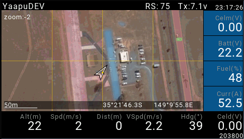</a>

 

### [GPS widget](https://github.com/moschotto/OpenTX_GPS_Telemetry)

GPS Telemetry Widget (B&W & Color). Shows total distance traveled, distance from home, as well as both home and last seen telemetry positions. Also logs to file, and has a log viewer so you don't have to worry about losing the coordinates if you turn the transmitter off. 
<a href="https://github.com/moschotto/OpenTX_GPS_Telemetry">
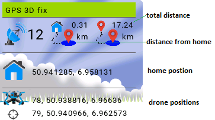
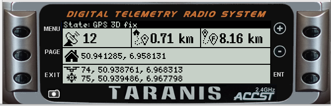
</a>

 

### [GPS Plus Code, Home Arrow and AvgBatt widgets](https://github.com/kristjanbjarni/opentx-widgets)

Collection of Colorlcd & B&W widgets.
For colorlcd includes GPS lat/long and Google Plus code widget, Home direction/distance widget, and average battery voltage widget.
For B&W includes GPS Telemetry screen, and Home distance telemetry screen. 
<a href="https://github.com/kristjanbjarni/opentx-widgets">
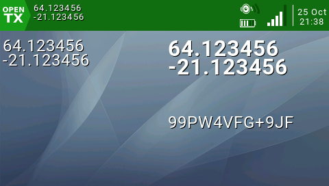
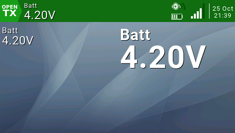

</a>

 

## Telemetery & Flight Controllers

### [Betaflight Setup](https://github.com/betaflight/betaflight-tx-lua-scripts)

The Betaflight LUA script allows you to change flight controller settings on your radio, such as PID, rates, VTX channels and power, and many more. 
<a href="https://github.com/betaflight/betaflight-tx-lua-scripts">
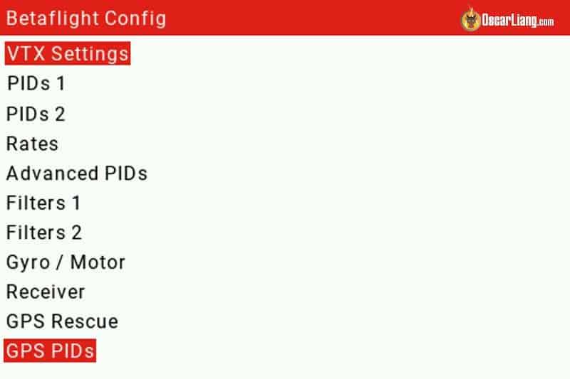
</a>

 

### [INAV Telemetry Flight Status](https://github.com/iNavFlight/OpenTX-Telemetry-Widget)

Shows you telementry and flight status information. Supports radios with color and black and white screens. 
<a href="https://github.com/iNavFlight/OpenTX-Telemetry-Widget">
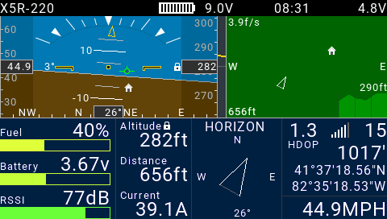
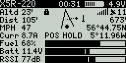
</a>

 

### [FM2M ToolBox](https://fm2m.online/toolbox-edgetx/)

Feature rich FM2M ToolBox is LUA App focusing on BetaFlight users. Provides dashboard with telemetry overview for all major RC Links, custom alerts , VTx info, GPS and much more. Supports radios with color and black and white screens. 
<a href="https://fm2m.online/toolbox-edgetx/">
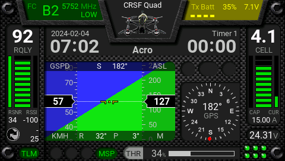
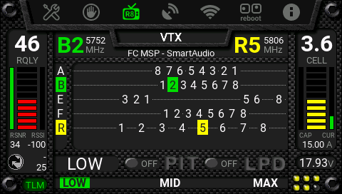
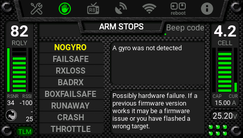
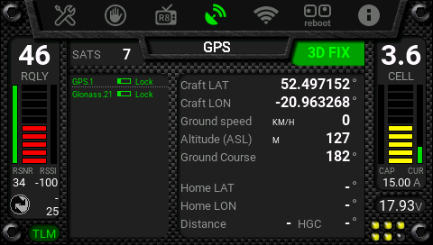
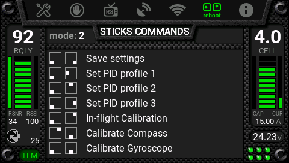
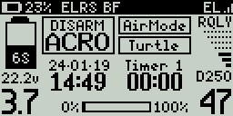
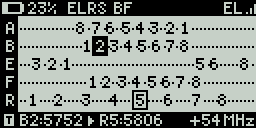
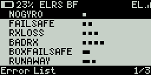
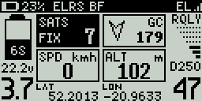
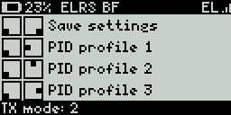
</a>

 

### [FM2M Digital Clock](https://fm2m.online/digital-clock-edgetx/)

Configurable EdgeTX widget that shows nifty Digital Clock. 
<a href="https://fm2m.online/digital-clock-edgetx/">
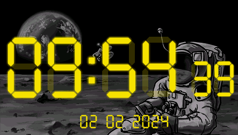
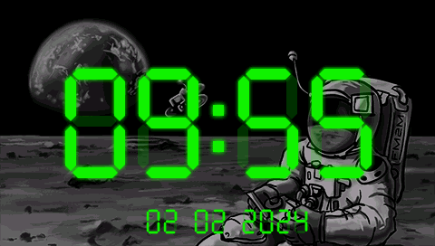
</a>
 

### [FM2M Widgets Pack](https://fm2m.online/addons-edgetx/#WPack)

Enhanced Model, Timer, Channels and Analog Clock widgets. 
<a href="https://fm2m.online/addons-edgetx/#WPack">
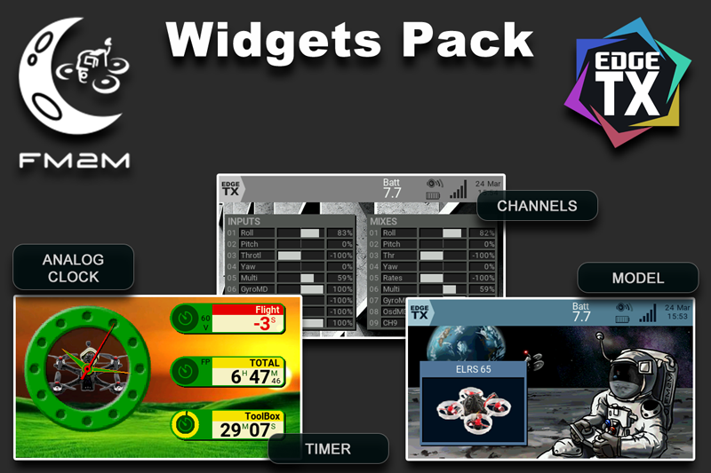
</a>

 

### [TBS Agent Lite](https://www.team-blacksheep.com/products/prod:agentx)

LUA configurator for numerous TBS products. Use this instead of Crossfire lua.

## Other

### [Show It All](https://rc-soar.com/opentx/lua/showitall/index.htm)

ShowItAll displays various information in a single pane. 
<a href="https://rc-soar.com/opentx/lua/showitall/index.htm">
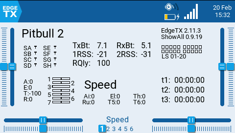
</a>

 

### [vu fullscreen image viewer widget for big screens](https://www.schleth.com/fpv/vu-a-simple-image-viewer-for-edgetx-radios-with-big-screens-2113.html)

View fullscreen images with layout information or photos, cycle through them and have quick access to your favourite one. 
<a href="https://www.schleth.com/fpv/vu-a-simple-image-viewer-for-edgetx-radios-with-big-screens-2113.html">
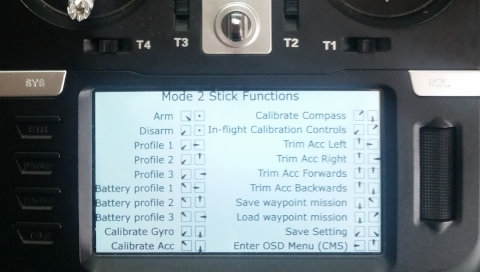
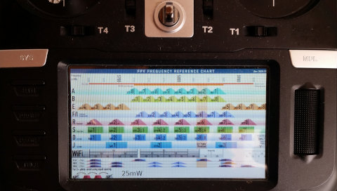
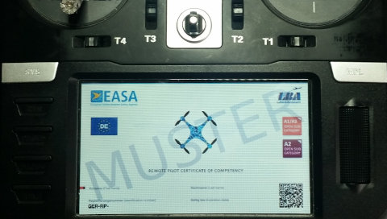
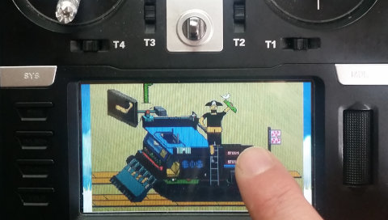
</a>

 

### [EdgeTX Goodies](https://github.com/MadMonkey87/EdgeTX-Goodies)

Some widgets, themes and other scripts for EdgeTX 
<a href="https://github.com/MadMonkey87/EdgeTX-Goodies">
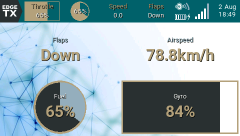

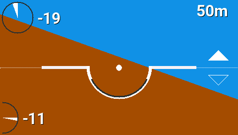
</a>

 

### [ImpExp](https://github.com/forbesmyester/EdgeTX-ImpExp)

Basic and slightly incomplete on-radio import / export functionality for EdgeTX. Can be used to move functions / logical switches / mixes etc between models.

<a href="https://github.com/forbesmyester/EdgeTX-ImpExp">
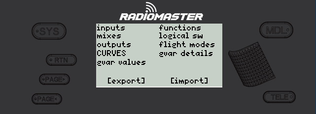
</a>

### [Switch2 widget](https://repository.justfly.solutions/index.php?view=product&id=115:switch-config)

Widget that shows switch positions with customisable icons. Shows all switches with different icons for every switch position. 
Links: [JustFly](https://repository.justfly.solutions/index.php?view=product&id=115:switch-config), [RCGroups](https://www.rcgroups.com/forums/showpost.php?p=50176699&postcount=4012)

<a href="https://www.rcgroups.com/forums/showpost.php?p=47009445&postcount=3793">
    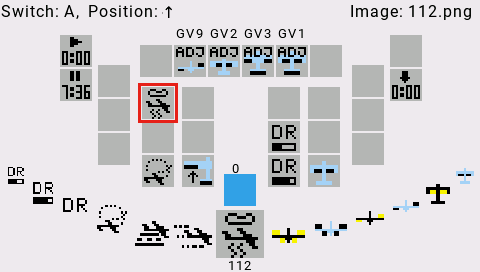
    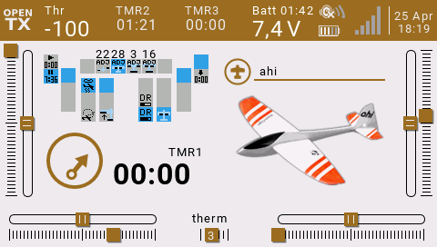
</a>
 

### [Multi Protocol Module Tools](https://github.com/pascallanger/DIY-Multiprotocol-TX-Module/tree/master/Lua_scripts)

Scripts to complement the Multi Protocol Module, such as allowing you to configure certain aspects of the module, automacitally name channels, do DSM forward programming, as well as other protocol specific tasks. 
<a href="https://github.com/pascallanger/DIY-Multiprotocol-TX-Module/tree/master/Lua_scripts">
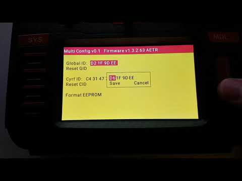
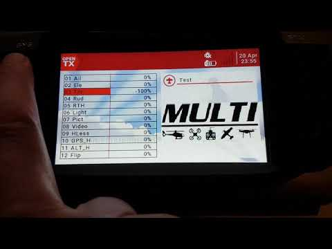
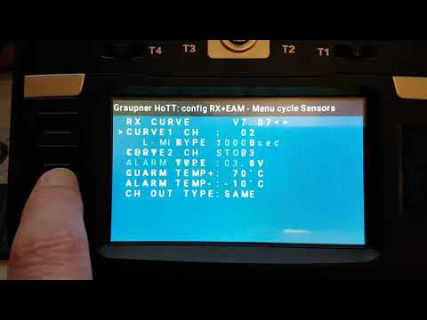
</a>
 

### [Spektrum DSM Tools](https://github.com/frankiearzu/DSMTools)

Scripts to use with Spektrum Receivers. It has easy to install zip files versions of:

- DSM Forward Programming (In collaboration with Multi-Module)
- Spektrum Telemetry Scripts, Including TextGen for AVIAN ESC programming. Will become telemetry widgets in the future.
  - Smart RXs (AR631,AR637, etc)
  - Blade Heli helpers (AR636 based)
- Interim EdgeTX Firmware with latest (but tested) changes for Spektrum Sensors and TextGen (Official EdgeTx 2.8.1 + only Spektrum Telemetry changes). This change will be included in EdgeTx 2.9.0
    
  <a href="https://github.com/frankiearzu/DSMTools">
  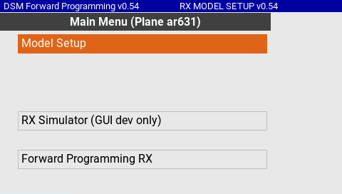
  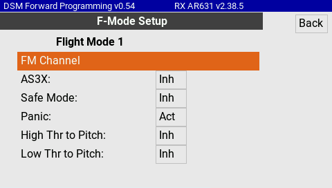
  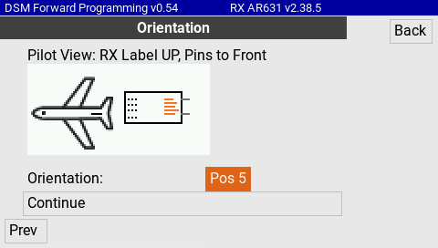
  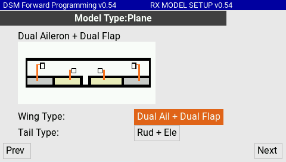
  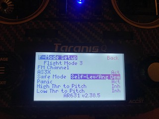
   
  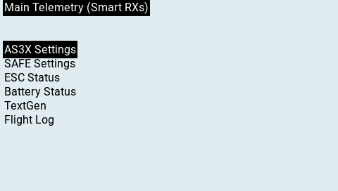
  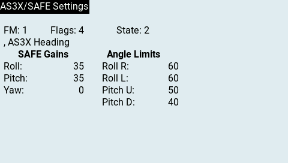
  </a>

 

### [Log Viewer](https://github.com/offer-shmuely/edgetx-x10-scripts/wiki/LogViewer)

Nice presentation of log file on the field 
no computer needed for logs anymore.

**Selecting files & columns**

### [Log Viewer (BW only)](https://github.com/nikbg3/EdgeTXLogViewerBW)

Simple EdgeTX LUA script for BW radios to read logs files on the display. Rotary wheel is used to change the read value. Back is used to switch between modes. i.e., changing columns, rows or files.

### [LogViz](https://github.com/icebreaker-ch/EdgeTX-LogViz)

A tool to visualize log entries, recorded by the SD Logging special function
on an EdgeTX B&W or color radio.

**Tested radios:** Radiomaster Zorro, Horus X12S, Horus X10S, Taranis X7 ACCESS, Taranis X9D+ 2019

**Features:**

- Selection of Model, File and Log-Entry.
- Display single Entry in graphical view
- Cursor navigation to see value and time stamp at position

### [LogManager](https://github.com/icebreaker-ch/EdgeTX-LogManager)

A tool for managing Log files (created by the SD Logging Special Function) on an EdgeTX B&W or color RC transmitter. Actions can be performed on all models or a selected model.

> [!NOTE]
> The color version of this tool uses the LVGL widgets API, thus EdgeTX version 2.11 or later is needed to run it. However, the B&W version can be used on color radios with older versions of EdgeTX.

 

### [FlyLog & TeleLog - Logging Scripts for EdgeTX](https://github.com/JohnnyCarvi/flylog_edgetx)

These scripts provide simple logging functionality for your flights, making it easy to record and review important flight events and telemetry data.

`flylog.lua`: Logs arming/disarming events, timestamps, GPS coordinates, and model name.
`tellog.lua`: Logs detailed telemetry data at regular intervals during flight.

For analyzing and visualizing the generated logs, you can use the [UAV Desk](https://uavdesk.app).

### [Widget for Voltage and Current Telemetry](https://github.com/fdm225/mahRe2)

Displays various battery related data. 

### [Quad Telemetry Dashboard (BW only)](https://github.com/mvaldesshc/advanced-edgetx-dashboard)

LUA-based dashboard (only for black-and-white display radios). 
<a href="https://github.com/mvaldesshc/advanced-edgetx-dashboard">

  <!--  -->
</a>

 

### [TSwitch Widget](https://github.com/Ziege-One/TSwitch)

Widget for color screen radios that allows touch buttons via logical switches (in German). 

### [Lap Timer](https://github.com/RadioMasterRC/EdgeTX-LapTimer)

Advanced lap timer script using as little controls as possible. It stores race and lap data for analysis back at the computer. 
<a href="https://github.com/RadioMasterRC/EdgeTX-LapTimer">
  
  
  
   
   
  
  
  
</a>

### [F3A Caller](https://github.com/jrwieland/F3A)

Caller for practicing F3A pattern - Updated to 2024 Season 

### [TaraniTunes](https://github.com/jrwieland/TaraniTunes-v4.x)

Enhanced music player for OpenTX & EdgeTX radios Multiple Playlists allow you to listen to your music while flying Your RC 
<a href="https://github.com/jrwieland/TaraniTunes-v4.x">

 

</a>

### [GPS QR Code generator](https://github.com/alufers/edgetx-gps-qrcode)

Generates a QR code of last GPS coordinates received (for black-and-white screen radios) 
<a href="https://github.com/alufers/edgetx-gps-qrcode">

 

</a>

### [Battery Percentage and mAh Used](https://github.com/jrwieland/Battery-mAh)

Widget to display the levels of Lipo/HV-Lipo battery with mAh used based on battery voltage from 'Cels' sensor (FLVSS) 

### [TxBatTele](https://github.com/derelict/TxBatTele)

Battery and Telemetry Monitoring LUA Widget which tries to rely as less as possible on radio settings (Everything is defined in the Script). So no need for "manual" Logical Switches or Custom Functions.

### [SwitchOverview](https://github.com/druckgott/getswitchesWdgets/)

A simple widget to display switches which are configured in special function and have a PLAY_TRACK behind.

### [GPS Viewer](https://github.com/ktaliaferro/gps-viewer)

Plot logged flight telemetry data on a map of your airfield.

### [GPS Logger (BW only)](https://github.com/poweredjj/gpslog)

Log each flight GPS coordinates to a separate GPX file (telemetry script for radios with BW displays only).

### [GPS Logger (color only)](https://github.com/poweredjj/gpslog_color)

Log each flight GPS coordinates to a separate GPX file (widget for radios with color displays only).

### [Multiswitch widget](https://github.com/wimalopaan/LUA)

This widget controls a so-called multiswitch inside a model. A multiswitch is a device that is most popular in the field of ship/crawler/functional-models, and its purpos is to switch on/off multiple electronic motors, LEDs, ... inside the model.

This widget controls a multiswitch via the CRSF protocol (ExpressLRS): https://github.com/wimalopaan/Electronics?tab=readme-ov-file#elrs_msw (or via ACCST/AFHDS2A and SBus ).
Multiple instances of this widget can control multiple multiswitches inside a model, upto 255 theoretically.

### [Hardware extension widget](https://github.com/wimalopaan/LUA)

This widget is called the hardware extension widget. Its purpose is to read and visualize the state of external controls like pots, switches, buttons, incrementals, ... . This is done via one of the serial connections of the radio (AUX1, AUX2) reading messages of the hardware extension protocol: https://github.com/wimalopaan/Electronics?tab=readme-ov-file#hwext.

By this means it can read external controls, like upto 16 11-bit (proportional) values as well as 64 binary switch values.

Ideally the firmware for the radio has PR EdgeTX/edgetx#5885, so that this widget can set the virtual controls according to the external controls.

\.png)
\.png)
\.png)

### [Virtual controls widget](https://github.com/wimalopaan/LUA)

This widget mainly manipulates the virtual controls as described in EdgeTX/edgetx#5885.
Virtual controls (virtual inputs and virtual switches) are non-physical inputs/switches for the radio. The main purpose is to extend the number of controls by use of virtual controls.

This widget can manipulate these virtual controls by means of up to 16 sliders and/or 64 buttons (normal, momentary or toggle).

If no virtual controls are available (firmware / simulator without EdgeTX/edgetx#5885), it is still useful as it can also manipulate the shm variables, which serve as a data exchange between widgets and mixer-scripts.

### [Stick Commands](https://github.com/DHaacke/Mambo-Tango)

Standalone Lua tool which provides a scrollable list of common stick commands for Betaflight, HDZero and INAV.

### [Battery and Connection Bars Widgets](https://github.com/calmarc/EdgeTX-Widgets)

Battery Voltage + LQ Display (custom Lua widget)

### [Field Notes](https://github.com/iamsunilchahal/edgetx-lua-scripts-bw?tab=readme-ov-file#2-fieldnoteslua)

A quick logging tool for recording flight details directly from your radio. Perfect for keeping track of pack health, prop condition, and flight notes between packs.

- Single-page list of editable fields (scroll & press-to-edit)
- Saves timestamped entries to /LOGS/fieldnotes.txt
- Exits automatically after saving

### [RGB Throttle indicator](https://github.com/btastic/rgb-throttle-edgetx/)

A script that lights up LED's based on the throttle input.

Only supports radios that have RGB leds special function capabilities.

